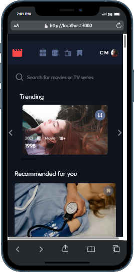
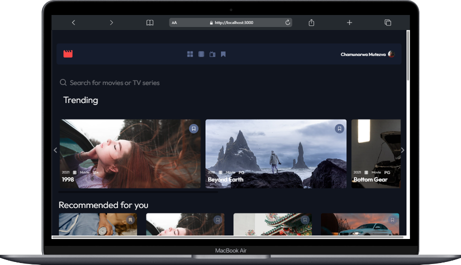
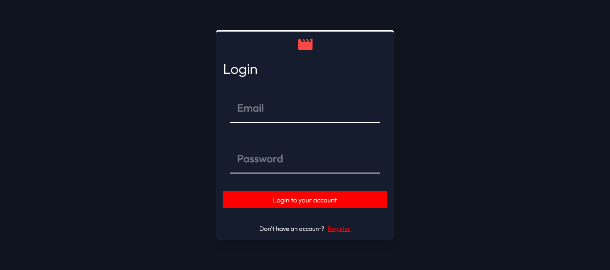
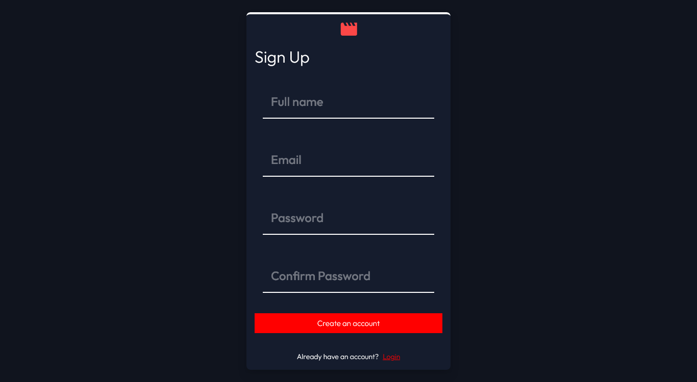
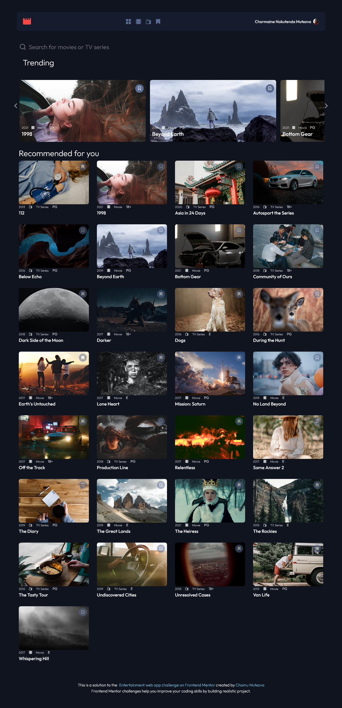

# Frontend Mentor - Entertainment web app solution

This is a solution to the [Entertainment web app challenge on Frontend Mentor](https://www.frontendmentor.io/challenges/entertainment-web-app-J-UhgAW1X). Frontend Mentor challenges help you improve your coding skills by building realistic project.

## Table of contents

- [Overview](#overview)
  - [The challenge](#the-challenge)
  - [Screenshot](#screenshot)
  - [Links](#links)
- [My process](#my-process)
  - [Start project](#start-project)
  - [Configuration](#configuration)
    - [Set up a MongoDB database](#set-up-a-mongodb-database)
    - [Set up environment variables](#set-up-environment-variables)
  - [Run Next.js in development mode](#run-nextjs-in-development-mode)
  - [Built with](#built-with)
  - [What I learned](#what-i-learned)
  - [Continued development](#continued-development)
  - [Useful resources](#useful-resources)
- [Author](#author)
- [Acknowledgments](#acknowledgments)

## Overview

### The challenge

Users should be able to:

- View the optimal layout for the app depending on their device's screen size
- See hover states for all interactive elements on the page
- Navigate between Home, Movies, TV Series, and Bookmarked Shows pages
- Add/Remove bookmarks from all movies and TV series
- Search for relevant shows on all pages
- authentication - (sign-up/login)

### Screenshot







### Links

- Frontend Mentor Solution URL: [Entertainment web app with NextJs , MongoDb and Next Auth](https://entertainment-web-app-mongo.vercel.app/)
- Live Site URL: [Entertainment web app](https://entertainment-web-app-mongo.vercel.app/)

## My process

### Start project

Execute [`create-next-app`](https://github.com/vercel/next.js/tree/canary/packages/create-next-app) with [npm](https://docs.npmjs.com/cli/init), [Yarn](https://yarnpkg.com/lang/en/docs/cli/create/), or [pnpm](https://pnpm.io) to bootstrap the example:

```bash
npx create-next-app --example with-mongodb with-mongodb-app
```

```bash
yarn create next-app --example with-mongodb with-mongodb-app
```

```bash
pnpm create next-app --example with-mongodb with-mongodb-app
```

### Configuration

#### Set up a MongoDB database

Set up a MongoDB database either locally or with [MongoDB Atlas for free](https://mongodb.com/atlas).

#### Set up environment variables

Copy the `env.local.example` file in this directory to `.env.local` (which will be ignored by Git):

```bash
cp .env.local.example .env.local
```

Set each variable on `.env.local`:

- `MONGODB_URI` - Your MongoDB connection string. If you are using [MongoDB Atlas](https://mongodb.com/atlas) you can find this by clicking the "Connect" button for your cluster.

### Run Next.js in development mode

```bash
npm install
npm run dev

# or

yarn install
yarn dev
```

Your app should be up and running on [http://localhost:3000](http://localhost:3000)! If it doesn't work, post on [GitHub discussions](https://github.com/vercel/next.js/discussions).

You will either see a message stating "You are connected to MongoDB" or "You are NOT connected to MongoDB". Ensure that you have provided the correct `MONGODB_URI` environment variable.

When you are successfully connected, you can refer to the [MongoDB Node.js Driver docs](https://mongodb.github.io/node-mongodb-native/3.4/tutorials/collections/) for further instructions on how to query your database.

### Built with

- [React](https://reactjs.org/) - JS library
- [Next.js](https://nextjs.org/) - React framework
- [Next Auth](https://next-auth.js.org/) - Authentication
- [Tailwind](https://tailwindcss.com/) - styling
- CSS Grid
- Mobile-first workflow

### What I learned

- [How to Scroll Horizontally in React JS - Styled With Tailwind CSS - Javascript](https://www.youtube.com/watch?v=x4bom6Udk_4)
- [Floating Label Input with React + Tailwind CSS + Hook Form](https://www.youtube.com/watch?v=jQDQOzjMZRo)
- [intergrating mongodb into your nextjs app](https://www.mongodb.com/developer/videos/integrating-mongodb-into-your-nextjs-app/)
- [How to Integrate MongoDB Into Your Next.js App](https://www.mongodb.com/developer/languages/javascript/nextjs-with-mongodb/)
- generate a secret token using the following url [secret token generator](https://generate-secret.vercel.app/32)

```html
<h1>Some HTML code I'm proud of</h1>
```

### Continued development

### Useful resources

## Author

- Website - [Chamu Mutezva](https://github.com/ChamuMutezva)
- Frontend Mentor - [@ChamuMutezva](https://www.frontendmentor.io/profile/ChamuMutezva)
- Twitter - [@ChamuMutezva](https://twitter.com/ChamuMutezva)

## Acknowledgments
